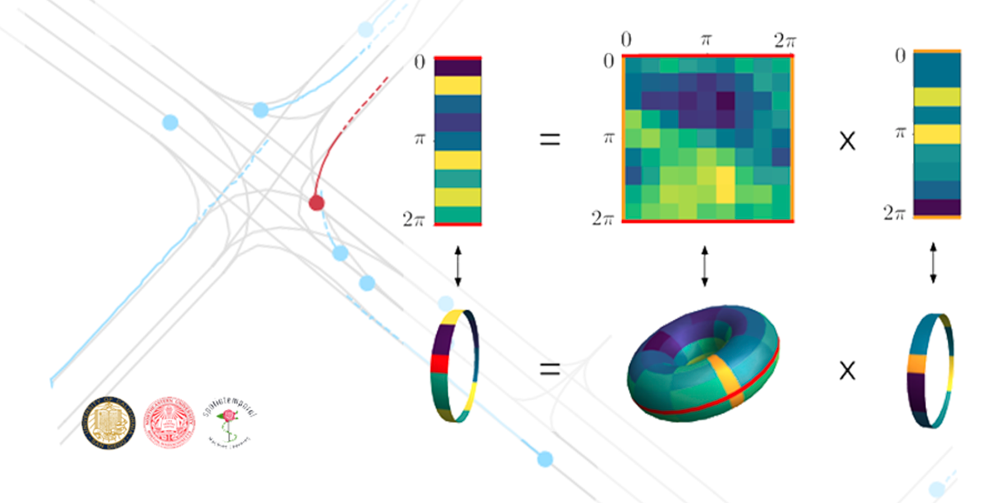

# Trajectory Prediction using Equivariant Continuous Convolution (ECCO)

This is the codebase for the ICLR 2021 paper [Trajectory Prediction using Equivariant Continuous Convolution](https://arxiv.org/abs/2010.11344), by Robin Walters, Jinxi Li and Rose Yu.



## Installation

This codebase is trained on Python 3.6.6+. For the usage of argoverse dataset, [argoverse-api](https://github.com/argoai/argoverse-api) is required. We recommand the reader to follow their guide to install the complete api and datasets. Other requirements include:
- numpy>=1.18.3
- pandas>=1.0.3
- torch==1.5.0

Dependency can be installed using the following command:
```bash
pip install -r requirements.txt
```

## Data Preparation

Original data could be downloaded from [argoverse](https://www.argoverse.org/data.html). To generate the training and validation data
1. Set the path to `argoverse_forecasting` in `datasets/preprocess_data.py` scripts.
2. Run the script
```bash
python preprocess_data.py
```
The data will be stored in `path/to/argoverse_forecasting/train(val)/lane_data`.

## Data Download

If you want to skip the data generation part, the link to preprocessed data will be provided soon.

## Model Training and Evaluation

Here are commands to train the model. The evaluation will be provided after the model is trained. 

For -ECCO, run the following command
```bash
python train.py --dataset_path /path/to/argoverse_forecasting/ --rho1 --model_name rho_1_ecco --train --evaluation
```

For -ECCO, run the following command
```bash
python train.py --dataset_path /path/to/argoverse_forecasting/ --rho-reg --model_name rho_1_ecco --train --evaluation
```

For the baseline evaluation, you can refer to [Argoverse Official Baseline](https://github.com/jagjeet-singh/argoverse-forecasting). Note: the evaluation of the constant velocity is evaluated on the validation set (filtered out the scenes with car number greater than 60) with the velocity at final timestamp as the constant velocity. 

## Citation

If you find this repository useful in your research, please cite our paper:
```
@article{Walters2021ECCO,
  title={Trajectory Prediction using Equivariant Continuous Convolution},
  author={Robin Walters and Jinxi Li and Rose Yu},
  journal={International Conference on Learning Representations},
  year={2021},
}
